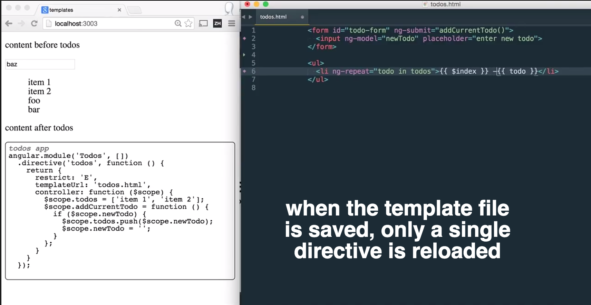

# ng-hot-templates

> Live reload for individual AngularJS directives when the template changes on the disk

[Demo video](https://www.youtube.com/watch?v=N5deNI0_caA)

You can edit individual directive's template files while running `grunt watch`,
and the affectd directive will be automatically reloaded in place (preserving the
scope data).

## How to run demo

* Install dependencies `npm install`
* Start `grunt watch`
* Start local server, for example [http-server][http-server] `http-server -p 3003`
* Open `localhost:3003` page
* Try editing and saving `todos.html` - template for the `Todos` directive.
    - The directive should reload, but its data should stay.

Note: because there is no cache busting, in order to actually fetch new template source
you need to disable cache in Chrome DevTools (DevTools -> Settings -> Disable cache)
and have DevTools open during this demo.

[http-server]: https://github.com/nodeapps/http-server

### Small print

Author: Gleb Bahmutov &copy; 2015

* [@bahmutov](https://twitter.com/bahmutov)
* [glebbahmutov.com](http://glebbahmutov.com)
* [blog](http://bahmutov.calepin.co/)

License: MIT - do anything with the code, but don't blame me if it does not work.

Spread the word: tweet, star on github, etc.

Support: if you find any problems with this module, email / tweet /
[open issue](https://github.com/bahmutov/ng-hot-templates/issues) on Github

## MIT License

Copyright (c) 2015 Gleb Bahmutov

Permission is hereby granted, free of charge, to any person
obtaining a copy of this software and associated documentation
files (the "Software"), to deal in the Software without
restriction, including without limitation the rights to use,
copy, modify, merge, publish, distribute, sublicense, and/or sell
copies of the Software, and to permit persons to whom the
Software is furnished to do so, subject to the following
conditions:

The above copyright notice and this permission notice shall be
included in all copies or substantial portions of the Software.

THE SOFTWARE IS PROVIDED "AS IS", WITHOUT WARRANTY OF ANY KIND,
EXPRESS OR IMPLIED, INCLUDING BUT NOT LIMITED TO THE WARRANTIES
OF MERCHANTABILITY, FITNESS FOR A PARTICULAR PURPOSE AND
NONINFRINGEMENT. IN NO EVENT SHALL THE AUTHORS OR COPYRIGHT
HOLDERS BE LIABLE FOR ANY CLAIM, DAMAGES OR OTHER LIABILITY,
WHETHER IN AN ACTION OF CONTRACT, TORT OR OTHERWISE, ARISING
FROM, OUT OF OR IN CONNECTION WITH THE SOFTWARE OR THE USE OR
OTHER DEALINGS IN THE SOFTWARE.
